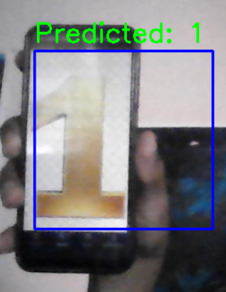
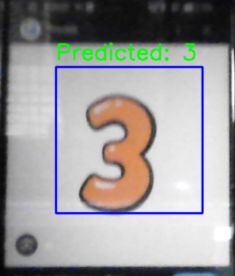
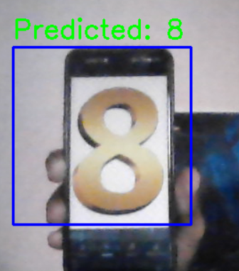
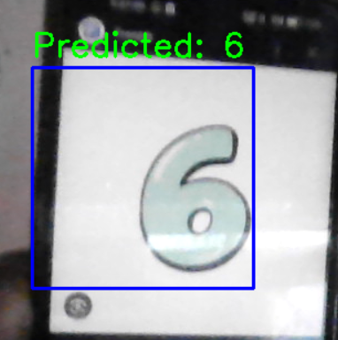

# Real-Time Handwritten Digit Recognizer ✍️

This project uses a Convolutional Neural Network (CNN) trained on the MNIST dataset to recognize handwritten digits in real-time from a webcam feed.

# OUTPUT:-

---

## Project Files

- `main.py` — Trains the CNN on MNIST dataset and saves the model as `my_model.h5`.
- `my_model.h5` — The trained model file.
- `realtime_digit_recognizer.py` — Uses webcam to predict handwritten digits in real-time.
- `requirements.txt` — Lists the required Python libraries.

---

## How to Run the Project

### 1. Clone the Repository

### 2. Create a Virtual Environment (optional but recommended)
     python -m venv digit-env
     digit-env\Scripts\activate

### 3.  Install Dependencies
     pip install -r requirements.txt

### 4. Option 1: Retrain the Model (Optional)
     If you want to train the model yourself:
     Use python (main.py)
     This will create/update the my_model.h5 file.

### Option 2: Directly Run Real-Time Recognition
     If you want to Directly Run Real-Time Recognition:
     Use python realtime_digit_recognizer.py
     This will run the code.

### NOTE:5. Press `q` to quit the webcam window.

#### How it Works
    * The model was trained on the MNIST handwritten digit dataset.

    * Using your webcam, you can write a number inside a blue box on the screen.

    * The system will predict and display the number above the box.
 